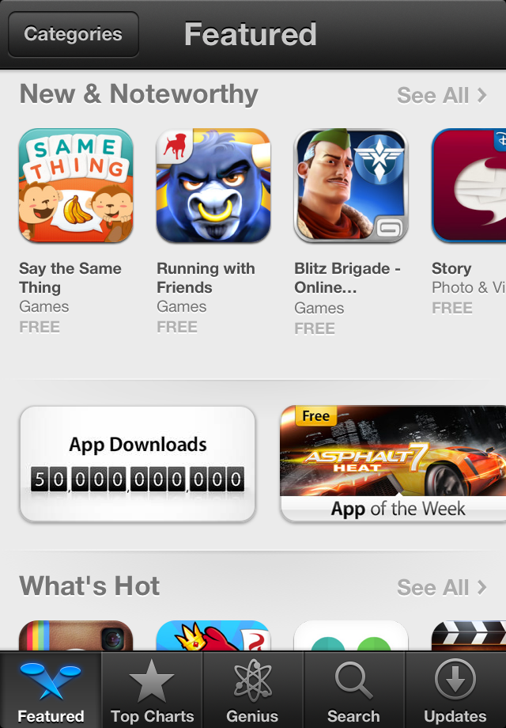

DMPagingScrollView
==================
What it does
------------
`DMPagingScrollView` extends the paging functionality of `UIScrollView` to support custom page dimensions.

An example of this can be seen on iOS 6's App Store Featured page.  

How to use it
-------------
The interface is very simple. To enable paging, you set `pagingEnabled` to `YES` just like `UIScrollView`. To configure the page dimensions, you can set `pageWidth` and `pageHeight` (non-positive means use the view's dimensions).

To include it in your project, you can just take the `DMPagingScrollView.h`/`DMPagingScrollView.m` files and drop them into your project. Alternatively, you can embed this project as a subproject and add `$(CONFIGURATION_BUILD_DIR)` and `"$(BUILD_ROOT)/../IntermediateBuildFilesPath/UninstalledProducts"` to your `Header Search Paths` build setting. You will also need `-ObjC` in `Other Linker Flags`.

License
-------
Licensed under the MIT license.